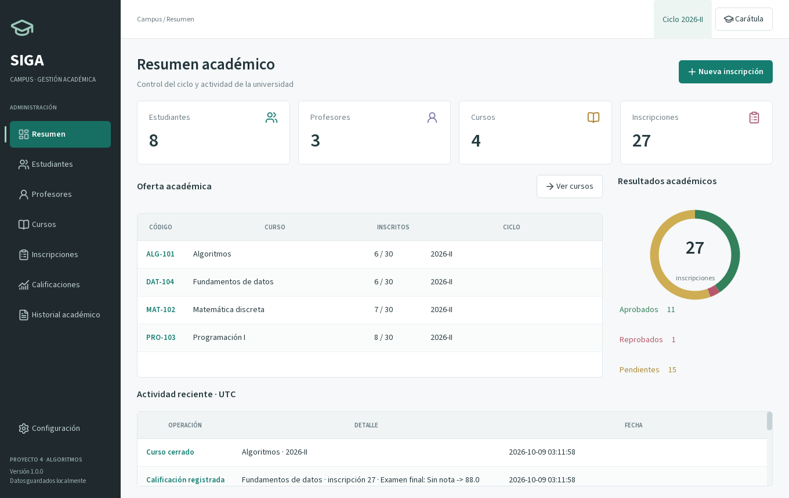

# SIGA Campus | Proyecto 4

Sistema de Gestión Académica Universitaria en **Python, PySide6 y SQLite**.
Aplicación de escritorio en español con interfaz institucional, persistencia local y pruebas automatizadas.

**[Descargar ejecutable para Windows](https://github.com/JoseCamposeco/proyecto4-siga-campus/releases/tag/v1.0.0)**



## Equipo

- José Gabriel Camposeco Santizo
- AXEL MIGUEL ESTRADA GARCÍA
- DAFHNE XIMENA GABRIEL ESCOBAR
- CRISTOFHER OMAR MUÑOZ ESCOBAR

**Carrera:** INGENIERÍA EN SISTEMAS  
**Curso:** ALGORITMOS  
**Docente:** DEMSHILL LEONEL COUTIÑO SANDOVAL

La carátula aparece antes de cada ejecución. Universidad, número de equipo y carnés
quedan pendientes de completar desde **Editar carátula** o **Configuración**.

## Funciones

| Requisito | Módulo |
|---|---|
| Registrar y editar estudiantes | Estudiantes |
| Registrar y editar profesores | Profesores |
| Registrar cursos y asignar profesor | Cursos |
| Inscribir estudiantes sin duplicados | Inscripciones |
| Crear evaluaciones y ponderaciones | Cursos / Evaluaciones |
| Registrar y modificar calificaciones | Calificaciones |
| Calcular promedio y aprobación | Calificaciones |
| Consultar cursos de un estudiante | Historial académico |
| Consultar inscritos en un curso | Inscripciones |
| Consultar historial por ciclo | Historial académico |

También incluye búsqueda, control de cupos, cierre de cursos, auditoría de notas,
exportación CSV, respaldo SQLite y demostración opcional con datos ficticios.

## Uso del ejecutable

1. Descargar `SIGA-Campus.exe` desde Releases y abrirlo en Windows 10/11 de 64 bits.
2. Verificar la carátula y entrar al sistema.
3. Registrar profesores, estudiantes y cursos; después realizar las inscripciones.
4. Registrar las notas en Calificaciones y guardar. El promedio y estado se actualizan automáticamente.

El ejecutable incluye Python y las bibliotecas. La primera extracción puede tardar
unos segundos. Los datos se guardan fuera del ejecutable, en la ruta visible en
Configuración. La aplicación funciona sin Internet.

En una base vacía aparece **Cargar demostración**. Es opcional y crea registros ficticios;
los integrantes del equipo no se convierten en estudiantes de demostración.

## Ejecutar el código

Recomendado: Python 3.14 de 64 bits.

```powershell
python -m venv .venv
.\.venv\Scripts\Activate.ps1
python -m pip install -r requirements.txt
python main.py
```

Para usar una base independiente durante la presentación:

```powershell
python main.py --data-dir datos-presentacion
```

## Criterio académico

- Notas entre **0 y 100**, con hasta dos decimales; el cero es una nota válida.
- Nota mínima de aprobación predeterminada: **70 puntos**.
- Plan inicial: Parcial 1 (20 %), Parcial 2 (20 %), Actividades (20 %) y Examen final (40 %).
- El plan es configurable antes de registrar notas y debe sumar exactamente 100 %.
- `nota_final = sum(nota_evaluacion * ponderacion / 100)`.
- La nota final se redondea a dos decimales con `ROUND_HALF_UP`; el estado utiliza ese mismo valor.
- Las evaluaciones sin nota aportan cero al acumulado; el resultado permanece **PENDIENTE** hasta completarlas todas.
- Una inscripción es única por estudiante y curso del ciclo. El mismo código de curso puede ofrecerse en otro ciclo.
- El cierre requiere todas las notas. Protege inscripciones y plan; admite correcciones completas de notas con auditoría.
- Prerrequisitos: no incluidos, ya que el proyecto los plantea como opcionales.

## Pruebas y compilación

```powershell
python -m pip install -r requirements-dev.txt
python -m pytest -q
python -m ruff check .
python -m ruff format --check .
python scripts/build.py
```

La compilación produce `dist/SIGA-Campus.exe`. Para verificar el binario sin interacción:

```powershell
.\dist\SIGA-Campus.exe --data-dir prueba-binario --smoke-test resultado.json
```

La carpeta indicada debe estar vacía: la autoverificación carga una demostración,
recorre los ocho módulos y genera un resultado JSON.

## Documentación

- [Manual de usuario](docs/MANUAL.md)
- [Arquitectura y guía para la exposición](docs/ARQUITECTURA.md)
- [Validaciones y resultados de pruebas](docs/VALIDACION.md)
- [Licencias de terceros](THIRD_PARTY_NOTICES.md)

El desarrollo local comenzó con un commit de alcance, seguido por la lógica,
la interfaz, las pruebas y la distribución. El repositorio remoto conserva además
los commits de publicación de cada módulo.
