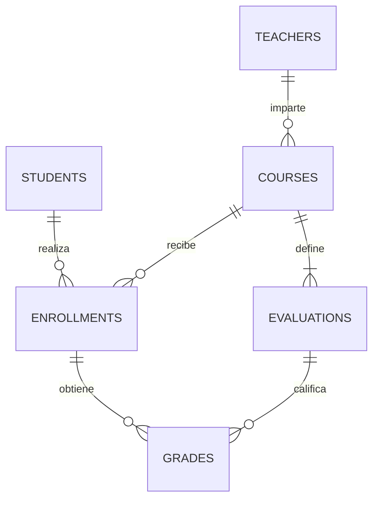

# Arquitectura y guía para la exposición

## Estructura

| Archivo | Responsabilidad |
|---|---|
| `main.py` | Argumentos, ubicación de datos, aplicación Qt y carátula inicial |
| `siga/database.py` | SQLite, validaciones, transacciones, promedios e historial |
| `siga/app.py` | Ventana, navegación y protección de cambios sin guardar |
| `siga/pages.py` | Ocho módulos y coordinación de formularios y tablas |
| `siga/dialogs.py` | Carátula, registro de personas, cursos y plan de evaluación |
| `siga/widgets.py` | Tablas, botones, iconos, contadores y gráfico animado |
| `siga/theme.py` | Tipografía y estilo institucional |
| `scripts/build.py` | Compilación Windows con PyInstaller |
| `tests/` | Pruebas de reglas de negocio y flujos Qt |

La lógica académica no depende de Qt. Se puede probar `AcademicStore` sin abrir
ventanas. La interfaz captura los datos y llama a ese servicio.

## Relaciones



`settings` almacena carátula y criterio de aprobación. `audit` guarda operaciones
y fechas UTC. Las claves foráneas evitan referencias a personas o cursos inexistentes.
Las restricciones UNIQUE protegen carnés, profesores, código/ciclo, inscripciones
y la pareja inscripción/evaluación. Un trigger refuerza cupos y cursos cerrados
directamente en SQLite, incluso con más de una instancia de la aplicación.

## Cálculo

Notas y porcentajes se almacenan como enteros en centésimas para evitar errores
de punto flotante. `70.25` se guarda como `7025`; `20 %` como `2000`.

```text
nota_final = sum(nota_en_centesimas * peso_en_centesimas) / 1_000_000
```

Ejemplo: 60, 70, 80 y 90 con pesos 20, 20, 20 y 40 producen:
`60*0.20 + 70*0.20 + 80*0.20 + 90*0.40 = 78.00`, APROBADO.
Cambiar la última nota a 50 produce 62.00, REPROBADO.

El redondeo se realiza con Decimal y ROUND_HALF_UP a dos decimales. La aprobación
compara ese mismo valor con el mínimo institucional configurado. Una nota vacía
permanece pendiente y no equivale a haber obtenido cero.

## Integridad de las operaciones

`record_grades` valida todas las celdas antes de escribir. Guarda notas y auditoría
en una transacción. Un fallo revierte el lote completo, incluso si ocurrió después
de actualizar una celda. Se verifica que la evaluación y la inscripción pertenezcan
al mismo curso.

El plan no se reemplaza si ya tiene notas. El cierre exige resultados completos.
Se conservan inscripciones por ciclo y se calculan resultados desde las notas
actuales para evitar promedios almacenados que puedan quedar desactualizados.

## Animaciones

- Aparición de la carátula con interpolación OutCubic.
- Transición entre módulos con opacidad de 240 ms.
- Indicador lateral que se desplaza hacia el módulo elegido en 320 ms.
- Contadores que interpolan a sus valores en 650 ms.
- Gráfico de resultados que se dibuja progresivamente en 850 ms.

Las animaciones usan el bucle de eventos de Qt y no bloquean el programa.
Configuración permite desactivarlas. Los tamaños de las tablas y controles
permanecen definidos durante las transiciones.

## Preparación de la defensa

1. Explicar la relación muchos-a-muchos estudiantes/cursos mediante inscripciones.
2. Demostrar registro, inscripción y rechazo de una inscripción duplicada.
3. Registrar una nota fuera de rango y mostrar la validación.
4. Mostrar el cálculo 78 y luego 62 al modificar el examen final.
5. Consultar historial y exportar CSV.
6. Ejecutar `python -m pytest -q` y explicar una prueba de transacción.

Cambios razonables que pueden pedir durante la exposición: cambiar el mínimo
de aprobación desde Configuración, ajustar los pesos de un curso sin notas,
añadir un campo a un formulario o cambiar colores en `theme.py`.

## Límites

Aplicación académica local, sin autenticación ni servidor multiusuario. No incluye
prerrequisitos, sincronización en la nube ni eliminación de historiales. SQLite
persiste fuera del ejecutable. Los respaldos se restauran en una carpeta separada.
